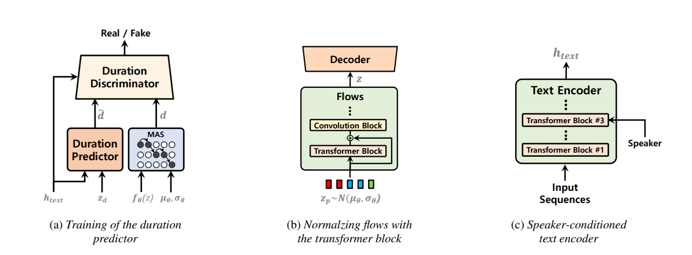

~[this is a work in progress, feel free to contribute! Model will be ready if this line is removed]~
[Most of the code is ready and the model is ready to train. Hopefully, someone from the community can share some results ASAP! Thanks!]

# Sample audio
(Training is in progress.) 
- (08/20/2023) - Added sample audio @104k steps. [ljspeech-nosdp](resources/test.wav) ; [tensorboard](https://github.com/p0p4k/vits2_pytorch/discussions/12)
- [vietnamese samples](https://github.com/p0p4k/vits2_pytorch/pull/10#issuecomment-1682307529) Thanks to [@ductho9799](https://github.com/ductho9799) for sharing!

# VITS2: Improving Quality and Efficiency of Single-Stage Text-to-Speech with Adversarial Learning and Architecture Design
### Jungil Kong, Jihoon Park, Beomjeong Kim, Jeongmin Kim, Dohee Kong, Sangjin Kim 
Unofficial implementation of the [VITS2 paper](https://arxiv.org/abs/2307.16430), sequel to [VITS paper](https://arxiv.org/abs/2106.06103). (thanks to the authors for their work!)



Single-stage text-to-speech models have been actively studied recently, and their results have outperformed two-stage pipeline systems. Although the previous single-stage model has made great progress, there is room for improvement in terms of its intermittent unnaturalness, computational efficiency, and strong dependence on phoneme conversion. In this work, we introduce VITS2, a single-stage text-to-speech model that efficiently synthesizes a more natural speech by improving several aspects of the previous work. We propose improved structures and training mechanisms and present that the proposed methods are effective in improving naturalness, similarity of speech characteristics in a multi-speaker model, and efficiency of training and inference. Furthermore, we demonstrate that the strong dependence on phoneme conversion in previous works can be significantly reduced with our method, which allows a fully end-toend single-stage approach.

## Credits
- We will build this repo based on the [VITS repo](https://github.com/jaywalnut310/vits). Currently I am adding vits2 changes in the 'notebooks' folder. The goal is to make this model easier to transfer learning from VITS pretrained model!
- (08-17-2023) - The authors were really kind to guide me through the paper and answer my questions. I am open to discuss any changes or answer questions regarding the implementation. Please feel free to open an issue or contact me directly.

## Jupyter Notebook for initial experiments
- [x] check the 'notebooks' folder for my initial implemntations of the modules.
- [x] contains Google Colab notebook for training LJ Speech dataset as an example.

## pre-requisites
1. Python >= 3.6
2. ~Now supports Pytorch version 2.0~ (08/17/2023) - Tested on Pytorch version 1.13.1 with Google Colab and LambdaLabs cloud.
3. Clone this repository
4. Install python requirements. Please refer [requirements.txt](requirements.txt)
    1. You may need to install espeak first: `apt-get install espeak`
5. Download datasets
    1. Download and extract the LJ Speech dataset, then rename or create a link to the dataset folder: `ln -s /path/to/LJSpeech-1.1/wavs DUMMY1`
    1. For mult-speaker setting, download and extract the VCTK dataset, and downsample wav files to 22050 Hz. Then rename or create a link to the dataset folder: `ln -s /path/to/VCTK-Corpus/downsampled_wavs DUMMY2`
6. Build Monotonic Alignment Search and run preprocessing if you use your own datasets.

```sh
# Cython-version Monotonoic Alignment Search
cd monotonic_align
python setup.py build_ext --inplace

# Preprocessing (g2p) for your own datasets. Preprocessed phonemes for LJ Speech and VCTK have been already provided.
# python preprocess.py --text_index 1 --filelists filelists/ljs_audio_text_train_filelist.txt filelists/ljs_audio_text_val_filelist.txt filelists/ljs_audio_text_test_filelist.txt 
# python preprocess.py --text_index 2 --filelists filelists/vctk_audio_sid_text_train_filelist.txt filelists/vctk_audio_sid_text_val_filelist.txt filelists/vctk_audio_sid_text_test_filelist.txt
```

## How to run (dry-run)
- model forward pass (dry-run)
```python
import torch
from models import SynthesizerTrn

net_g = SynthesizerTrn(
    n_vocab=256,
    spec_channels=80, # <--- vits2 parameter (changed from 513 to 80)
    segment_size=8192,
    inter_channels=192,
    hidden_channels=192,
    filter_channels=768,
    n_heads=2,
    n_layers=6,
    kernel_size=3,
    p_dropout=0.1,
    resblock="1", 
    resblock_kernel_sizes=[3, 7, 11],
    resblock_dilation_sizes=[[1, 3, 5], [1, 3, 5], [1, 3, 5]],
    upsample_rates=[8, 8, 2, 2],
    upsample_initial_channel=512,
    upsample_kernel_sizes=[16, 16, 4, 4],
    n_speakers=0,
    gin_channels=0,
    use_sdp=True, 
    use_transformer_flows=True, # <--- vits2 parameter
    transformer_flow_type="fft", # <--- vits2 parameter (choose from "pre_conv","fft","mono_layer")
    use_spk_conditioned_encoder=True, # <--- vits2 parameter
    use_noise_scaled_mas=True, # <--- vits2 parameter
    use_duration_discriminator=True, # <--- vits2 parameter
)

x = torch.LongTensor([[1, 2, 3],[4, 5, 6]]) # token ids
x_lengths = torch.LongTensor([3, 2]) # token lengths
y = torch.randn(2, 80, 100) # mel spectrograms
y_lengths = torch.Tensor([100, 80]) # mel spectrogram lengths

net_g(
    x=x,
    x_lengths=x_lengths,
    y=y,
    y_lengths=y_lengths,
)

# calculate loss and backpropagate
```

## Training Example
```sh
# LJ Speech
# python train.py -c configs/vits2_ljs_base.json -m ljs_base
python train.py -c configs/vits2_ljs_nosdp.json -m ljs_base # no-sdp; (recommended)

python train.py -c configs/vits2_ljs_base.json -m ljs_base # with sdp;

# VCTK
python train_ms.py -c configs/vits2_vctk_base.json -m vctk_base
```

## Updates, TODOs, features and notes

- (08/22/203) update 3 - fixed missing/uninitialised variables for duration predictor/discriminator. [#14](https://github.com/p0p4k/vits2_pytorch/issues/14)
- (08/22/2023) update 2 - Fixed DurationDiscriminator backward pass. Fixed typos and requirements.txt. Will train on LambdaLabs cloud and update the code if any errors. Added Google Colab notebook for training in the 'notebooks' folder.
- (08/22/2023) update 1 - Added Adverserial DurationDiscriminator using Conv layers (thanks to the authors for guidance). Updated notebook and train scripts. Will test andd update a training run soon.
- (08/20/2023) update 1 - Added sample audio @104k steps.
- (08/17/2023) update 5 - Does not support pytorch2.0 anymore. Please use pytorch1.13.1 ( I tried on Google Colab and it works fine; will update with a Colab notebook soon!)
- (08/17/2023) update 4  - Fixed multi-spk DataLoader
- (08/17/2023) update 3 - QOL changes to generate mel spec from existing lin spec. Updated inference.ipynb.
- (08/17/2023) update 2 - hotfix for "use_mel_posterior_encoder" flag in config file. Should fix [#8](https://github.com/p0p4k/vits2_pytorch/issues/8) and [#9](https://github.com/p0p4k/vits2_pytorch/issues/9). Will do a if-else cleanup later.
- (08/17/2023) update 1 - After some discussions with the authors, I implemented "mono-layer" transformer flow which seems to be the closest to what they intend. It is a single layer transformer flow used as the first layer before the traditional conv-residual-flows. Need to experiment to check the best transformer flow type of the three. (pre_conv, fft, mono_layer). But, each of the layers serves similar purpose of long range dependency using attention.
- (08/10/2023) update 1 - updated multi_GPU training, ~support pytorch2.0~ [#5](https://github.com/p0p4k/vits2_pytorch/pull/5)
- (08/09/2023) update - Corrected MAS with noise_scale and updated train_ms.py, train.py (thanks to [@KdaiP](https://github.com/KdaiP) for testing and pointing out the bug in MAS)
- (08/08/2023) update 2 - Changed data_utils.py to take in "use_mel_posterior_encoder" flag.
- (08/08/2023) update 1 - Added "use_noise_scaled_mas" flag in config file. Added sanity checks in notebooks. Everything except adverserial duration predictor is ready to train.
- (08/072023) update 2 - transformer_flow_type "fft" and "pre_conv" added. [@lexkoro](https://github.com/lexkoro) suggested "fft" transformer flow is better than "pre_conv" transformer flow in his intial experiments.
- (08/07/2023 update 1 - vits2_vctk_base.json and vits2_ljs_base.json are ready to train; multi-speaker and single-speaker models respectively)
- (08/06/2023 update - dry run is ready; duration predictor will complete within next week)
- (08/05/2023 update - everything except the duration predictor is ready to train and we can expect some improvement from VITS1)
- (08/04/2023 update - initial codebaase is ready; paper is being read)

#### Duration predictor (fig 1a) 
- [x] Added LSTM discriminator to duration predictor in notebook.
- [x] Added adversarial loss to duration predictor. ("use_duration_discriminator" flag in config file; default is "True")
- [x] Monotonic Alignment Search with Gaussian Noise added in 'notebooks' folder; need expert verification (Section 2.2)
- [x] Added "use_noise_scaled_mas" flag in config file. Choose from True or False; updates noise while training based on number of steps and never goes below 0.0
- [x] Update models.py/train.py/train_ms.py
- [x] Update config files (vits2_vctk_base.json; vits2_ljs_base.json)
- [x] Update losses in train.py and train_ms.py
#### Transformer block in the normalizing flow (fig 1b)
- [x] Added transformer block to the normalizing flow in notebook. There are three types of transformer blocks: pre-convolution (my implementation), FFT (from [so-vits-svc](https://github.com/svc-develop-team/so-vits-svc/commit/fc8336fffd40c39bdb225c1b041ab4dd15fac4e9) repo) and mono-layer.
- [x] Added "transformer_flow_type" flag in config file. Choose from "pre_conv" or "fft" or "mono_layer".
- [x] Added layers and blocks in models.py 
(ResidualCouplingTransformersLayer, 
ResidualCouplingTransformersBlock,
FFTransformerCouplingLayer,
MonoTransformerFlowLayer)
- [x] Add in config file (vits2_ljs_base.json; can be turned on using "use_transformer_flows" flag)
#### Speaker-conditioned text encoder (fig 1c)
- [x] Added speaker embedding to the text encoder in notebook.
- [x] Added speaker embedding to the text encoder in models.py (TextEncoder; backward compatible with VITS)
- [x] Add in config file (vits2_ljs_base.json; can be turned on using "use_spk_conditioned_encoder" flag)
#### Mel spectrogram posterior encoder (Section 3)
- [x] Added mel spectrogram posterior encoder in notebook.
- [x] Added mel spectrogram posterior encoder in train.py 
- [x] Addded new config file (vits2_ljs_base.json; can be turned on using "use_mel_posterior_encoder" flag)
- [x] Updated 'data_utils.py' to use the "use_mel_posterior_encoder" flag for vits2
#### Training scripts
- [x] Added vits2 flags to train.py (single-speaer model)
- [x] Added vits2 flags to train_ms.py (multi-speaker model)

## Special mentions
- [@erogol](https://github.com/erogol) for quick feedback and guidance. (Please check his awesome [CoquiTTS](https://github.com/coqui-ai/TTS) repo).
- [@lexkoro](https://github.com/lexkoro) for discussions and help with the prototype training.
- [@manmay-nakhashi](https://github.com/manmay-nakhashi) for discussions and help with the code.
- [@athenasaurav](https://github.com/athenasaurav) for offering GPU support for training.
