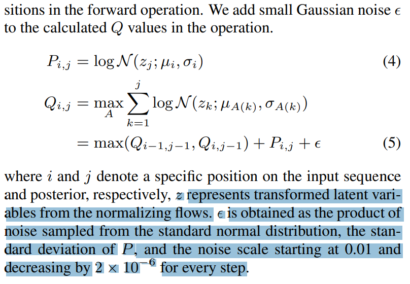
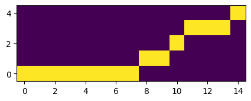
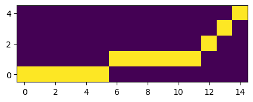

```python
import os
os.chdir(r'../../vits2_pytorch')
```


```python
import math

import torch
from torch import nn
from torch.nn import functional as F

import monotonic_align
import matplotlib.pyplot as plt

x_mask = torch.ones([1, 1, 5])
y_mask = torch.ones([1, 1, 15])
z_p = torch.randn([1, 192, 15])
m_p = torch.randn([1, 192, 5]) 
logs_p = torch.randn([1, 192, 5])

s_p_sq_r = torch.exp(-2 * logs_p) # [b, d, t]
neg_cent1 = torch.sum(-0.5 * math.log(2 * math.pi) - logs_p, [1], keepdim=True) # [b, 1, t_s]
neg_cent2 = torch.matmul(-0.5 * (z_p ** 2).transpose(1, 2), s_p_sq_r) # [b, t_t, d] x [b, d, t_s] = [b, t_t, t_s]
neg_cent3 = torch.matmul(z_p.transpose(1, 2), (m_p * s_p_sq_r)) # [b, t_t, d] x [b, d, t_s] = [b, t_t, t_s]
neg_cent4 = torch.sum(-0.5 * (m_p ** 2) * s_p_sq_r, [1], keepdim=True) # [b, 1, t_s]
neg_cent = neg_cent1 + neg_cent2 + neg_cent3 + neg_cent4

attn_mask = torch.unsqueeze(x_mask, 2) * torch.unsqueeze(y_mask, -1)
attn = monotonic_align.maximum_path(neg_cent, attn_mask.squeeze(1)).unsqueeze(1).detach()


noise_scale_initial = 0.01
noise_scale_delta = 2e-6
epsilon = torch.sum(logs_p, dim=1).exp() * torch.randn_like(neg_cent) * 0.01

neg_cent2 = neg_cent + epsilon

attn_mask = torch.unsqueeze(x_mask, 2) * torch.unsqueeze(y_mask, -1)
attn2 = monotonic_align.maximum_path(neg_cent2, attn_mask.squeeze(1)).unsqueeze(1).detach()

epsilon2 = torch.sum(logs_p, dim=1).exp() * torch.randn_like(neg_cent) * (0.01 - (5000*noise_scale_delta))
neg_cent3 = neg_cent + epsilon2

attn_mask = torch.unsqueeze(x_mask, 2) * torch.unsqueeze(y_mask, -1)
attn3 = monotonic_align.maximum_path(neg_cent3, attn_mask.squeeze(1)).unsqueeze(1).detach()

plt.figure(figsize=(5, 5))
plt.imshow(attn[0][0].T, origin='lower')
plt.figure(figsize=(5, 5))
plt.imshow(attn2[0][0].T, origin='lower')
plt.figure(figsize=(5, 5))
plt.imshow(attn3[0][0].T, origin='lower')
```


    <matplotlib.image.AxesImage at 0x1f0a141ad70>


    

    


    

    


    

    

