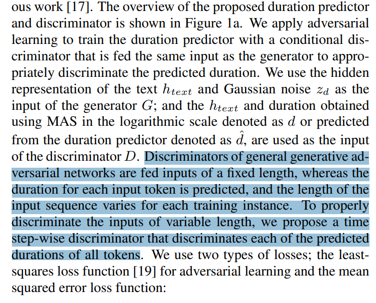

```python
import torch
import torch.nn as nn

class DurationDiscriminator(nn.Module):
    def __init__(self, input_dim, hidden_dim, num_layers=2):
        super(DurationDiscriminator, self).__init__()
        self.input_dim = input_dim
        self.hidden_dim = hidden_dim
        self.num_layers = num_layers
        
        # Define the LSTM layer to handle variable-length inputs
        self.lstm = nn.LSTM(input_size=input_dim, hidden_size=hidden_dim, num_layers=num_layers, batch_first=True)
        
        # Define the output layer for discrimination (e.g., binary classification)
        self.output_layer = nn.Sequential(
            nn.Linear(hidden_dim, 1),  # Output a single value for binary classification
            nn.Sigmoid()  # Sigmoid activation to map to a probability range [0, 1]
        )

    def forward(self, htext, durations):
        # Make sure the input dimensions match
        assert htext.size(-1) + durations.size(-1) == self.input_dim, "Input dimensions mismatch!"
        
        # Combine the input htext and durations into a single tensor
        combined_input = torch.cat((htext, durations), dim=-1)
        
        # Pass the combined input through the LSTM to handle variable-length sequences
        lstm_out, _ = self.lstm(combined_input)
        
        # Get the output from the last time step (assuming the discriminator is time step-wise)
        last_output = lstm_out[:, -1, :]
        
        # Get the final output of the discriminator (probability of being real/fake)
        discriminator_output = self.output_layer(last_output)
        
        return discriminator_output

# Example usage:
hidden_dim = 192  # Dimension of the hidden layer in the LSTM
input_dim = hidden_dim + 1  # Dimension of the input representations (htext and durations combined)
discriminator = DurationDiscriminator(input_dim=input_dim, hidden_dim=hidden_dim)

# Sample inputs (replace with actual data during training)
htext = torch.randn(16, 10, 192)  # Batch size: 16, Sequence length: 10, Input dimension: 256
durations = torch.randn(16, 10, 1)  # Batch size: 16, Sequence length: 10, Duration dimension: 1

# Pass inputs through the discriminator
output_prob = discriminator(htext, durations)

print(output_prob.shape)  # Output shape: (batch_size, 1)
```

    torch.Size([16, 1])
    


```python
output_prob
```


    tensor([[0.5167],
            [0.5129],
            [0.5023],
            [0.5097],
            [0.5113],
            [0.5091],
            [0.5130],
            [0.5122],
            [0.5071],
            [0.5070],
            [0.5045],
            [0.5066],
            [0.5034],
            [0.5034],
            [0.5054],
            [0.5083]], grad_fn=<SigmoidBackward0>)


