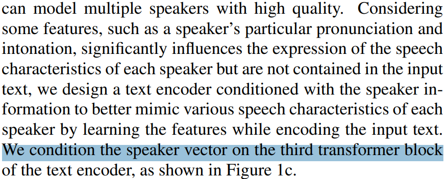

```python
# there are several ways to add speaker info to the transformer layer

```


```python
import os
os.chdir(r'../../vits2_pytorch')
```


```python
import torch
from torch import nn
from torch.nn import functional as F

from modules import *
from attentions import *
```

    c:\ProgramData\Anaconda3\envs\pytorch\lib\site-packages\tqdm\auto.py:21: TqdmWarning: IProgress not found. Please update jupyter and ipywidgets. See https://ipywidgets.readthedocs.io/en/stable/user_install.html
      from .autonotebook import tqdm as notebook_tqdm
    


```python
class Encoder(nn.Module): #backward compatible vits2 encoder
  def __init__(
      self, hidden_channels, filter_channels, n_heads, n_layers, kernel_size=1, p_dropout=0., window_size=4, **kwargs
      ):
    super().__init__()
    self.hidden_channels = hidden_channels
    self.filter_channels = filter_channels
    self.n_heads = n_heads
    self.n_layers = n_layers
    self.kernel_size = kernel_size
    self.p_dropout = p_dropout
    self.window_size = window_size

    self.drop = nn.Dropout(p_dropout)
    self.attn_layers = nn.ModuleList()
    self.norm_layers_1 = nn.ModuleList()
    self.ffn_layers = nn.ModuleList()
    self.norm_layers_2 = nn.ModuleList()
    # if kwargs has spk_emb_dim, then add a linear layer to project spk_emb_dim to hidden_channels
    if 'gin_channels' in kwargs:
      self.gin_channels = kwargs['gin_channels']
      if self.gin_channels != 0:
        self.spk_emb_linear = nn.Linear(self.gin_channels, self.hidden_channels)
        # vits2 says 3rd block, so idx is 2 by default
        self.cond_layer_idx = kwargs['cond_layer_idx'] if 'cond_layer_idx' in kwargs else 2
        print(self.gin_channels, self.cond_layer_idx)
        assert self.cond_layer_idx < self.n_layers, 'cond_layer_idx should be less than n_layers'
      
    for i in range(self.n_layers):
      self.attn_layers.append(MultiHeadAttention(hidden_channels, hidden_channels, n_heads, p_dropout=p_dropout, window_size=window_size))
      self.norm_layers_1.append(LayerNorm(hidden_channels))
      self.ffn_layers.append(FFN(hidden_channels, hidden_channels, filter_channels, kernel_size, p_dropout=p_dropout))
      self.norm_layers_2.append(LayerNorm(hidden_channels))

  def forward(self, x, x_mask, g=None):
    attn_mask = x_mask.unsqueeze(2) * x_mask.unsqueeze(-1)
    x = x * x_mask
    for i in range(self.n_layers):
      if i == self.cond_layer_idx and g is not None:
        g = self.spk_emb_linear(g.transpose(1, 2))
        g = g.transpose(1, 2)
        x = x + g
        x = x * x_mask
      y = self.attn_layers[i](x, x, attn_mask)
      y = self.drop(y)
      x = self.norm_layers_1[i](x + y)

      y = self.ffn_layers[i](x, x_mask)
      y = self.drop(y)
      x = self.norm_layers_2[i](x + y)
    x = x * x_mask
    return x
```


```python
# hidden_channels, filter_channels, n_heads, n_layers, kernel_size=1, p_dropout=0., window_size=4, **kwargs
txtEncoder = Encoder(
    hidden_channels=192,
    filter_channels=768,
    n_heads=2,
    n_layers=6,
    gin_channels=256,
)
```

    256 2
    


```python
# test with random data
x = torch.randn(1, 192, 5)
x_mask = torch.ones(1, 1, 5)
x_mask[:, :, 3:] = 0
g = torch.randn(1, 256, 1)
hidden_x = txtEncoder(x, x_mask, g)
```

    tensor([[[ 1.7823e-01, -4.8041e-02, -7.6686e-01, -0.0000e+00, -0.0000e+00],
             [-8.8037e-01, -1.3982e+00, -1.2542e+00, -0.0000e+00, -0.0000e+00],
             [ 1.0422e-01, -3.6065e-01, -6.8273e-02, -0.0000e+00, -0.0000e+00],
             [-2.4100e-01, -2.2441e-01, -4.6314e-01,  0.0000e+00,  0.0000e+00],
             [ 2.6315e+00, -1.1557e+00, -1.1396e+00, -0.0000e+00, -0.0000e+00],
             [-1.3643e+00,  4.8595e-01,  8.8579e-01, -0.0000e+00, -0.0000e+00],
             [ 2.9051e-01, -9.1046e-01, -3.6054e-01, -0.0000e+00, -0.0000e+00],
             [-1.0256e+00,  6.1531e-01, -1.1213e+00,  0.0000e+00,  0.0000e+00],
             [-4.5769e-01, -8.1682e-01, -7.3125e-01, -0.0000e+00, -0.0000e+00],
             [-1.4534e-02, -2.5581e-01, -8.0130e-01,  0.0000e+00,  0.0000e+00],
             [-4.5869e-01, -5.5056e-01, -4.4311e-02, -0.0000e+00, -0.0000e+00],
             [-1.5989e-01,  1.6693e+00,  1.2696e+00,  0.0000e+00,  0.0000e+00],
             [-1.3909e+00, -4.4440e-01, -2.0833e+00, -0.0000e+00, -0.0000e+00],
             [-1.9018e+00, -1.1316e+00, -1.8363e+00, -0.0000e+00, -0.0000e+00],
             [-5.0638e-01,  2.0340e+00,  1.4105e+00,  0.0000e+00,  0.0000e+00],
             [ 6.0573e-01,  1.6495e+00,  1.4691e+00,  0.0000e+00,  0.0000e+00],
             [ 9.8119e-01,  7.8612e-01,  9.6938e-01, -0.0000e+00, -0.0000e+00],
             [-8.3021e-01, -7.4825e-01, -8.8934e-01,  0.0000e+00,  0.0000e+00],
             [-8.1881e-01,  3.6110e-01,  8.7347e-01,  0.0000e+00,  0.0000e+00],
             [-8.0696e-01, -4.7812e-01, -1.0176e+00,  0.0000e+00,  0.0000e+00],
             [ 1.6046e+00, -2.5318e-01,  7.8001e-01,  0.0000e+00,  0.0000e+00],
             [-1.0171e+00, -9.6531e-01,  1.3129e-02,  0.0000e+00, -0.0000e+00],
             [ 1.3380e+00,  6.2173e-01,  9.4274e-01,  0.0000e+00,  0.0000e+00],
             [-2.3412e+00,  6.3974e-01, -7.3505e-01, -0.0000e+00, -0.0000e+00],
             [ 4.0944e-02, -5.3560e-01, -3.4665e-02, -0.0000e+00, -0.0000e+00],
             [ 1.3397e+00,  1.1266e+00, -1.0657e-01,  0.0000e+00,  0.0000e+00],
             [ 1.2588e-01, -8.0783e-01,  9.0336e-01,  0.0000e+00,  0.0000e+00],
             [-1.0804e+00, -1.5048e+00, -1.1147e+00, -0.0000e+00, -0.0000e+00],
             [-2.8733e-01, -4.5530e-01,  2.0764e-01,  0.0000e+00,  0.0000e+00],
             [ 1.1057e+00,  5.6611e-01, -3.4260e-01,  0.0000e+00,  0.0000e+00],
             [-1.3359e+00,  7.6677e-02, -7.4385e-01,  0.0000e+00,  0.0000e+00],
             [-3.8226e-01, -5.1160e-01, -7.4614e-01,  0.0000e+00,  0.0000e+00],
             [ 6.0318e-01, -1.1306e-01,  2.0639e+00, -0.0000e+00, -0.0000e+00],
             [ 1.1011e-01,  4.8387e-01,  2.1036e+00, -0.0000e+00, -0.0000e+00],
             [ 2.9540e-02,  1.5888e+00, -1.3550e+00, -0.0000e+00, -0.0000e+00],
             [-8.3662e-01,  3.5152e-01,  1.9683e-01,  0.0000e+00,  0.0000e+00],
             [-5.1851e-01, -6.1063e-01, -4.4356e-01, -0.0000e+00, -0.0000e+00],
             [ 8.4610e-01,  1.2192e+00, -6.3479e-01, -0.0000e+00, -0.0000e+00],
             [ 7.5672e-01, -2.3236e-02,  8.5611e-01,  0.0000e+00,  0.0000e+00],
             [ 1.3557e+00,  9.7040e-01,  7.1973e-01, -0.0000e+00,  0.0000e+00],
             [-2.5411e-01,  1.2668e+00,  9.0686e-02, -0.0000e+00, -0.0000e+00],
             [-1.4897e+00, -4.8598e-01,  5.1285e-01,  0.0000e+00,  0.0000e+00],
             [-1.6295e+00, -2.4853e+00, -1.5862e+00, -0.0000e+00, -0.0000e+00],
             [-4.6026e-01, -8.0742e-01, -1.6225e-01, -0.0000e+00, -0.0000e+00],
             [-8.3991e-01, -2.8588e+00, -7.4179e-01, -0.0000e+00, -0.0000e+00],
             [-6.4276e-01, -8.0391e-01, -2.3269e+00, -0.0000e+00, -0.0000e+00],
             [ 2.3946e+00,  1.1703e+00,  9.6319e-01,  0.0000e+00,  0.0000e+00],
             [-2.4727e+00, -2.4545e+00, -2.6627e+00, -0.0000e+00, -0.0000e+00],
             [-1.9960e+00, -4.5584e-01, -6.9070e-02,  0.0000e+00,  0.0000e+00],
             [ 6.8826e-01, -1.3613e+00, -1.6234e-01, -0.0000e+00, -0.0000e+00],
             [ 5.2016e-01, -3.1826e-01, -3.4533e-01, -0.0000e+00, -0.0000e+00],
             [-1.4322e+00, -5.1428e-01,  7.9503e-01,  0.0000e+00,  0.0000e+00],
             [ 1.5216e+00,  2.5334e+00,  9.8221e-01,  0.0000e+00,  0.0000e+00],
             [-8.7129e-01, -8.2961e-01, -1.6831e+00, -0.0000e+00, -0.0000e+00],
             [-4.7490e-01, -1.6200e+00,  8.3231e-01,  0.0000e+00,  0.0000e+00],
             [ 3.6578e-02, -3.9621e-01, -2.6481e-02,  0.0000e+00,  0.0000e+00],
             [ 2.8794e-01,  1.1967e-01,  6.0095e-01, -0.0000e+00, -0.0000e+00],
             [ 6.4022e-01,  9.6049e-01,  7.6433e-01,  0.0000e+00,  0.0000e+00],
             [ 9.4069e-01,  8.4414e-01,  1.5448e+00,  0.0000e+00,  0.0000e+00],
             [ 5.7705e-01, -1.6305e+00,  1.5950e-01, -0.0000e+00, -0.0000e+00],
             [-1.8564e+00, -3.1732e-01, -1.7989e+00, -0.0000e+00, -0.0000e+00],
             [ 2.0123e+00,  5.3236e-01,  3.3152e+00,  0.0000e+00,  0.0000e+00],
             [ 2.1944e-01,  1.8920e+00,  1.0481e+00,  0.0000e+00,  0.0000e+00],
             [ 2.0963e-01, -1.5582e+00, -2.1013e-01,  0.0000e+00,  0.0000e+00],
             [ 2.1503e-01, -3.2911e-02, -5.8960e-01, -0.0000e+00, -0.0000e+00],
             [ 7.6202e-01, -8.3539e-01,  4.7734e-02,  0.0000e+00,  0.0000e+00],
             [ 9.7682e-01, -3.2894e-01,  3.4273e-01, -0.0000e+00, -0.0000e+00],
             [ 1.6886e+00, -2.0612e+00, -8.1554e-02, -0.0000e+00, -0.0000e+00],
             [ 1.2639e+00, -3.0696e-01,  2.4875e-02, -0.0000e+00, -0.0000e+00],
             [-1.3981e+00,  4.5201e-01, -7.7745e-01, -0.0000e+00, -0.0000e+00],
             [-1.8676e+00, -1.9615e+00, -3.4126e-01, -0.0000e+00, -0.0000e+00],
             [-7.1836e-01,  9.8880e-01, -9.9046e-01,  0.0000e+00,  0.0000e+00],
             [-1.5717e+00, -6.2463e-01, -1.4778e+00,  0.0000e+00,  0.0000e+00],
             [-1.1940e+00,  1.6644e+00, -1.2047e-01,  0.0000e+00,  0.0000e+00],
             [-7.1098e-01,  8.6855e-01,  1.2607e+00,  0.0000e+00,  0.0000e+00],
             [-9.3395e-01, -5.7854e-01,  9.1141e-02,  0.0000e+00,  0.0000e+00],
             [-1.8712e+00, -2.3261e-01, -1.8060e+00, -0.0000e+00, -0.0000e+00],
             [ 1.0157e+00, -4.4933e-02,  7.1222e-02,  0.0000e+00,  0.0000e+00],
             [-1.3946e+00, -6.7801e-01, -2.3310e+00, -0.0000e+00, -0.0000e+00],
             [ 3.4585e-01,  5.7738e-02,  4.0785e-01, -0.0000e+00, -0.0000e+00],
             [ 2.3800e+00,  2.5114e+00,  2.8456e-01,  0.0000e+00,  0.0000e+00],
             [ 2.2237e-01,  1.1776e-01, -6.0573e-01, -0.0000e+00, -0.0000e+00],
             [-8.0260e-01, -2.3105e+00, -6.7222e-01, -0.0000e+00, -0.0000e+00],
             [ 4.6431e-01, -3.6228e-01, -1.0300e+00,  0.0000e+00,  0.0000e+00],
             [ 7.5798e-01, -5.5696e-01,  9.7654e-01, -0.0000e+00, -0.0000e+00],
             [-7.7917e-01,  1.2549e+00, -4.1268e-01, -0.0000e+00, -0.0000e+00],
             [-4.9847e-01,  1.2192e+00,  9.0623e-01,  0.0000e+00,  0.0000e+00],
             [-1.7167e-01, -9.0711e-01,  6.3121e-01, -0.0000e+00, -0.0000e+00],
             [ 1.8024e+00, -3.6373e-03,  2.2973e+00,  0.0000e+00,  0.0000e+00],
             [ 1.9355e+00,  9.0606e-01,  1.5483e+00,  0.0000e+00,  0.0000e+00],
             [ 9.5346e-02,  1.4000e+00, -6.2124e-01,  0.0000e+00,  0.0000e+00],
             [-2.5028e+00, -3.1853e+00, -3.4257e-01, -0.0000e+00, -0.0000e+00],
             [ 2.1331e+00,  5.4584e-01,  5.9735e-01, -0.0000e+00, -0.0000e+00],
             [-2.5207e-01, -5.1337e-01, -1.5161e+00, -0.0000e+00, -0.0000e+00],
             [ 1.0420e-01,  9.3963e-01, -1.7075e+00, -0.0000e+00, -0.0000e+00],
             [ 1.0827e+00,  2.1359e+00,  3.5513e-01,  0.0000e+00,  0.0000e+00],
             [-1.9315e+00, -1.3711e+00, -1.4845e+00, -0.0000e+00, -0.0000e+00],
             [-5.9992e-01,  2.7588e+00, -7.6363e-01,  0.0000e+00,  0.0000e+00],
             [-1.8412e+00, -2.5090e-01,  3.1226e-01, -0.0000e+00, -0.0000e+00],
             [ 2.5400e+00,  1.0495e+00,  3.7192e-01, -0.0000e+00,  0.0000e+00],
             [-1.1791e+00, -8.0082e-01, -2.5466e+00, -0.0000e+00, -0.0000e+00],
             [ 7.7804e-01,  3.0601e-01,  4.4509e-02, -0.0000e+00,  0.0000e+00],
             [-1.4432e+00, -3.7496e-01, -1.1544e+00,  0.0000e+00,  0.0000e+00],
             [ 2.7495e-01, -7.6058e-02,  1.6497e+00,  0.0000e+00,  0.0000e+00],
             [-2.7261e+00, -8.2840e-01, -1.0870e+00,  0.0000e+00,  0.0000e+00],
             [ 3.8139e-01, -2.1919e-01, -6.4002e-02, -0.0000e+00, -0.0000e+00],
             [ 1.2943e+00, -8.4257e-01, -3.6495e-01,  0.0000e+00,  0.0000e+00],
             [ 2.5753e-01, -8.8010e-01, -4.4464e-03,  0.0000e+00,  0.0000e+00],
             [-1.4802e-01, -3.7437e-01, -5.6908e-01, -0.0000e+00, -0.0000e+00],
             [ 1.7388e+00,  1.8929e-01,  6.9017e-01, -0.0000e+00, -0.0000e+00],
             [ 1.1760e+00, -1.8647e-01,  1.1865e+00,  0.0000e+00,  0.0000e+00],
             [-4.3955e-01,  4.8221e-01,  4.8429e-01,  0.0000e+00,  0.0000e+00],
             [-1.2218e+00, -1.5112e+00,  1.5720e+00, -0.0000e+00, -0.0000e+00],
             [ 6.6366e-02, -6.5303e-01,  7.0773e-01,  0.0000e+00,  0.0000e+00],
             [ 2.1907e+00,  8.5839e-01, -6.1421e-01, -0.0000e+00, -0.0000e+00],
             [ 1.1253e+00,  8.0719e-01,  2.7760e-01,  0.0000e+00,  0.0000e+00],
             [ 5.8989e-01, -1.2278e+00,  1.1712e-01,  0.0000e+00,  0.0000e+00],
             [-6.0617e-01,  8.7909e-03,  8.6454e-01,  0.0000e+00,  0.0000e+00],
             [-5.0255e-01, -3.9446e-01, -7.6437e-01, -0.0000e+00, -0.0000e+00],
             [-1.5286e+00, -1.5543e+00, -5.4960e-01, -0.0000e+00, -0.0000e+00],
             [-2.0083e-01, -9.4090e-01,  3.4639e-01, -0.0000e+00, -0.0000e+00],
             [-2.2792e-01, -1.1745e+00,  6.7743e-01, -0.0000e+00, -0.0000e+00],
             [ 1.4835e+00, -4.3522e-01,  6.6544e-01,  0.0000e+00,  0.0000e+00],
             [-5.7306e-01, -3.9981e-01, -1.5551e-02, -0.0000e+00, -0.0000e+00],
             [ 8.7228e-01, -5.4895e-01, -2.8260e-01,  0.0000e+00,  0.0000e+00],
             [ 7.8211e-01,  3.6351e-01, -1.1520e+00, -0.0000e+00, -0.0000e+00],
             [-5.8162e-01,  5.6111e-01,  1.1066e+00,  0.0000e+00,  0.0000e+00],
             [-1.0726e+00, -1.0737e+00,  1.2157e+00, -0.0000e+00, -0.0000e+00],
             [ 2.2764e+00,  1.8728e+00,  2.6858e+00,  0.0000e+00,  0.0000e+00],
             [ 1.3267e+00, -8.7044e-01,  1.1499e-02,  0.0000e+00,  0.0000e+00],
             [ 6.5723e-02,  5.1754e-01, -1.1447e+00,  0.0000e+00,  0.0000e+00],
             [ 6.4351e-01,  1.4850e+00, -5.4493e-01, -0.0000e+00, -0.0000e+00],
             [ 1.4413e+00,  1.1937e+00, -9.7373e-01, -0.0000e+00, -0.0000e+00],
             [-2.8064e+00, -7.0025e-01, -2.0263e+00, -0.0000e+00, -0.0000e+00],
             [ 3.5939e-01, -9.8969e-01,  1.6120e+00, -0.0000e+00, -0.0000e+00],
             [-1.8895e+00, -3.5742e-03, -1.0872e+00, -0.0000e+00, -0.0000e+00],
             [ 1.8540e+00,  2.6901e+00,  1.3751e+00,  0.0000e+00,  0.0000e+00],
             [-3.1736e-01,  8.0329e-01, -2.6228e-01, -0.0000e+00, -0.0000e+00],
             [ 1.0779e+00,  5.7852e-01, -1.0708e+00, -0.0000e+00, -0.0000e+00],
             [ 5.9175e-01,  1.5253e+00,  1.8561e-01,  0.0000e+00,  0.0000e+00],
             [ 1.6314e+00, -7.0927e-02, -3.0107e-01,  0.0000e+00,  0.0000e+00],
             [ 1.4518e+00,  1.5138e-01, -2.9080e-01, -0.0000e+00, -0.0000e+00],
             [-9.8856e-01,  1.8865e-01,  3.1118e+00,  0.0000e+00,  0.0000e+00],
             [-5.5704e-03, -1.1812e+00, -5.7691e-01, -0.0000e+00, -0.0000e+00],
             [-8.2114e-03, -8.5646e-01, -2.2078e+00, -0.0000e+00, -0.0000e+00],
             [ 1.6621e-01, -3.8580e-01, -1.1682e+00, -0.0000e+00, -0.0000e+00],
             [ 7.2397e-01,  2.8181e-01,  1.4477e+00,  0.0000e+00,  0.0000e+00],
             [ 2.1660e-01,  1.2852e+00,  1.4120e+00,  0.0000e+00,  0.0000e+00],
             [ 7.5421e-01,  1.9670e+00,  8.2700e-01, -0.0000e+00, -0.0000e+00],
             [-1.0368e+00,  2.4502e-02,  3.9477e-01, -0.0000e+00, -0.0000e+00],
             [ 1.4541e+00,  9.6458e-01,  1.8048e+00,  0.0000e+00,  0.0000e+00],
             [ 3.0031e-02,  1.1901e+00, -8.9679e-01,  0.0000e+00,  0.0000e+00],
             [ 1.2790e+00,  6.8024e-02,  7.2027e-01,  0.0000e+00,  0.0000e+00],
             [-3.9337e-01,  6.2220e-01,  1.3769e+00,  0.0000e+00,  0.0000e+00],
             [ 6.2153e-01,  2.7422e+00,  4.1973e-01,  0.0000e+00,  0.0000e+00],
             [-1.0105e+00,  7.3866e-01,  4.7808e-01, -0.0000e+00, -0.0000e+00],
             [-8.3452e-01, -3.1658e-01, -5.7416e-01,  0.0000e+00,  0.0000e+00],
             [ 5.0182e-01, -9.4908e-01,  1.0308e+00,  0.0000e+00,  0.0000e+00],
             [-1.1172e+00,  8.0961e-01, -1.0937e+00,  0.0000e+00,  0.0000e+00],
             [ 1.5282e+00,  5.6107e-01,  1.3770e+00,  0.0000e+00,  0.0000e+00],
             [ 4.6140e-01,  1.5350e+00, -4.0542e-01, -0.0000e+00, -0.0000e+00],
             [-3.9502e-01, -1.7306e+00, -2.4757e-01, -0.0000e+00, -0.0000e+00],
             [-1.1025e+00, -2.2291e+00,  1.1867e-01, -0.0000e+00, -0.0000e+00],
             [-1.2335e-01,  3.4965e-01,  3.9544e-02,  0.0000e+00,  0.0000e+00],
             [ 5.4630e-01,  1.3411e+00, -1.4366e+00,  0.0000e+00,  0.0000e+00],
             [ 1.9020e+00,  6.2166e-01,  6.9219e-01,  0.0000e+00,  0.0000e+00],
             [-1.0773e+00, -2.0043e+00, -6.6829e-01, -0.0000e+00, -0.0000e+00],
             [ 2.4709e-01, -3.2763e-02, -3.2034e-01, -0.0000e+00, -0.0000e+00],
             [ 1.1080e+00, -9.7261e-02,  1.5680e+00,  0.0000e+00,  0.0000e+00],
             [-2.2457e+00,  1.1205e+00, -1.0912e+00, -0.0000e+00, -0.0000e+00],
             [-8.5626e-01, -2.0565e+00, -1.8156e+00, -0.0000e+00, -0.0000e+00],
             [ 2.1210e-01, -1.7003e-01, -3.8343e-01,  0.0000e+00,  0.0000e+00],
             [ 6.0339e-01,  3.0993e-01,  3.0815e-01,  0.0000e+00,  0.0000e+00],
             [ 2.2145e+00,  6.1780e-01,  1.0377e+00,  0.0000e+00,  0.0000e+00],
             [ 9.0964e-01,  1.6082e+00,  1.8226e-01,  0.0000e+00,  0.0000e+00],
             [-6.0423e-01, -2.2233e+00,  5.0361e-02, -0.0000e+00, -0.0000e+00],
             [-8.0714e-01, -8.3279e-01,  2.7966e-01, -0.0000e+00, -0.0000e+00],
             [ 8.0291e-01,  1.0243e+00, -5.9018e-01, -0.0000e+00, -0.0000e+00],
             [-9.7130e-01, -8.0707e-01,  5.0110e-01,  0.0000e+00,  0.0000e+00],
             [-1.4014e+00, -5.4587e-01,  4.4386e-01, -0.0000e+00, -0.0000e+00],
             [-1.0077e+00, -3.1630e-01,  1.5704e-02, -0.0000e+00, -0.0000e+00],
             [-5.6896e-01,  3.5989e+00, -2.3529e-01,  0.0000e+00,  0.0000e+00],
             [-9.8548e-01, -2.6443e+00,  9.4160e-01,  0.0000e+00,  0.0000e+00],
             [ 9.0755e-01, -7.7869e-01,  3.8043e-02, -0.0000e+00, -0.0000e+00],
             [-4.3258e-02,  2.5719e+00,  4.8945e-01,  0.0000e+00,  0.0000e+00],
             [ 1.2230e+00,  2.2047e-01, -3.0164e-01, -0.0000e+00, -0.0000e+00],
             [ 2.5611e+00,  2.0595e+00,  9.8659e-01,  0.0000e+00,  0.0000e+00],
             [-1.8003e-01, -1.9642e+00,  5.7365e-01, -0.0000e+00, -0.0000e+00],
             [ 1.0678e-01,  1.2300e+00,  1.8143e-01,  0.0000e+00,  0.0000e+00],
             [-4.9921e-01, -1.1746e+00,  1.1223e-01,  0.0000e+00,  0.0000e+00],
             [-2.8288e-01,  2.1218e+00,  1.7703e+00,  0.0000e+00,  0.0000e+00],
             [-3.1531e-01,  1.4236e+00, -5.9130e-01,  0.0000e+00,  0.0000e+00]]],
           grad_fn=<MulBackward0>)
    
