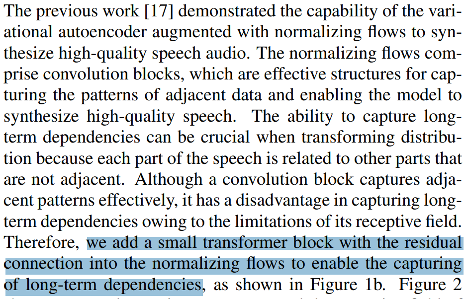

<p> I might be completely wrong, but I just added transformers before the conv layer in residual flows before calculating the flow stats. I have tested that they are completely invertible. However, I think the authors want to add trasnformer on the output of the upsampled hidden text features. I am not sure if that is possible because the stats of that flow are calculated before the transformers. I would be happy to discuss in detail if anyone is interested. Please let me know if I am wrong. Thanks!


```python
import os
os.chdir(r'../../vits2_pytorch')
```


```python
import torch
from torch import nn
from torch.nn import functional as F

from models import SynthesizerTrn
from modules import *
import attentions
```

    c:\ProgramData\Anaconda3\envs\pytorch\lib\site-packages\tqdm\auto.py:21: TqdmWarning: IProgress not found. Please update jupyter and ipywidgets. See https://ipywidgets.readthedocs.io/en/stable/user_install.html
      from .autonotebook import tqdm as notebook_tqdm
    


```python
n_vocab=256
spec_channels=80 # mel-spectrogram channels vits2 (vits1 used 513)
segment_size=8192
inter_channels=192
hidden_channels=192
filter_channels=768
n_heads=2
n_layers=6
kernel_size=3
p_dropout=0.1
resblock="1" 
resblock_kernel_sizes=[3, 7, 11]
resblock_dilation_sizes=[[1, 3, 5], [1, 3, 5], [1, 3, 5]]
upsample_rates=[8, 8, 2, 2]
upsample_initial_channel=512
upsample_kernel_sizes=[16, 16, 4, 4]
n_speakers=0
gin_channels=0
use_sdp=True
```


```python
class ResidualCouplingTransformersLayer(nn.Module):
    def __init__(
        self,
        channels,
        hidden_channels,
        kernel_size,
        dilation_rate,
        n_layers,
        p_dropout=0,
        gin_channels=0,
        mean_only=False,
    ):
        assert channels % 2 == 0, "channels should be divisible by 2"
        super().__init__()
        self.channels = channels
        self.hidden_channels = hidden_channels
        self.kernel_size = kernel_size
        self.dilation_rate = dilation_rate
        self.n_layers = n_layers
        self.half_channels = channels // 2
        self.mean_only = mean_only
        #vits2
        self.pre_transformer = attentions.Encoder(
            self.half_channels,
            self.half_channels,
            n_heads=2,
            n_layers=2,
            kernel_size=3,
            p_dropout=0.1,
            window_size=None
            )
        
        self.pre = nn.Conv1d(self.half_channels, hidden_channels, 1)
        self.enc = WN(
            hidden_channels,
            kernel_size,
            dilation_rate,
            n_layers,
            p_dropout=p_dropout,
            gin_channels=gin_channels,
        )
        #vits2
        self.post_transformer = attentions.Encoder( 
            self.hidden_channels,
            self.hidden_channels,
            n_heads=2,
            n_layers=2,
            kernel_size=3,
            p_dropout=0.1,
            window_size=None
            )
        
        self.post = nn.Conv1d(hidden_channels, self.half_channels * (2 - mean_only), 1)
        self.post.weight.data.zero_()
        self.post.bias.data.zero_()

    def forward(self, x, x_mask, g=None, reverse=False):
        x0, x1 = torch.split(x, [self.half_channels] * 2, 1)
        x0_ = self.pre_transformer(x0 * x_mask, x_mask) #vits2
        x0_ = x0_ + x0 #vits2
        h = self.pre(x0_) * x_mask #changed from x0 to x0_ to retain x0 for the flow
        h = self.enc(h, x_mask, g=g)
        h = self.post_transformer(h, x_mask) #vits2
        stats = self.post(h) * x_mask
        if not self.mean_only:
            m, logs = torch.split(stats, [self.half_channels] * 2, 1)
        else:
            m = stats
            logs = torch.zeros_like(m)
        if not reverse:
            x1 = m + x1 * torch.exp(logs) * x_mask
            x = torch.cat([x0, x1], 1)
            logdet = torch.sum(logs, [1, 2])
            return x, logdet
        else:
            x1 = (x1 - m) * torch.exp(-logs) * x_mask
            x = torch.cat([x0, x1], 1)
            return x

```


```python
#  'channels', 'hidden_channels', 'kernel_size', 'dilation_rate', and 'n_layers
test_flow_layer = ResidualCouplingTransformersLayer(
    inter_channels, hidden_channels, 5, 1, 4
)
```


```python
# test with random data
x = torch.randn(1, 192, 5)
x_mask = torch.ones(1, 1, 5)

```


```python
flowop = test_flow_layer(x, x_mask)
# revese flow
rev_flowop = test_flow_layer(flowop[0], x_mask, reverse=True)
(rev_flowop == x).sum() == x.numel() # flow works.
```


    tensor(True)


#### below is another way to do it from the [so-vits-svc](https://github.com/svc-develop-team/so-vits-svc/commit/fc8336fffd40c39bdb225c1b041ab4dd15fac4e9) repo 


```python
class TransformerCouplingLayer(nn.Module):
  def __init__(self,
      channels,
      hidden_channels,
      kernel_size,
      n_layers,
      n_heads,
      p_dropout=0,
      filter_channels=768,
      mean_only=False,
      gin_channels = 0
      ):
    assert channels % 2 == 0, "channels should be divisible by 2"
    super().__init__()
    self.channels = channels
    self.hidden_channels = hidden_channels
    self.kernel_size = kernel_size
    self.n_layers = n_layers
    self.half_channels = channels // 2
    self.mean_only = mean_only

    self.pre = nn.Conv1d(self.half_channels, hidden_channels, 1)
    self.enc = attentions.FFT(
       hidden_channels, 
       filter_channels, 
       n_heads, 
       n_layers, 
       kernel_size, 
       p_dropout, 
       isflow = True, 
       gin_channels = gin_channels
       )
    self.post = nn.Conv1d(hidden_channels, self.half_channels * (2 - mean_only), 1)
    self.post.weight.data.zero_()
    self.post.bias.data.zero_()

  def forward(self, x, x_mask, g=None, reverse=False):
    x0, x1 = torch.split(x, [self.half_channels]*2, 1)
    h = self.pre(x0) * x_mask
    h = self.enc(h, x_mask, g=g)
    stats = self.post(h) * x_mask
    if not self.mean_only:
      m, logs = torch.split(stats, [self.half_channels]*2, 1)
    else:
      m = stats
      logs = torch.zeros_like(m)

    if not reverse:
      x1 = m + x1 * torch.exp(logs) * x_mask
      x = torch.cat([x0, x1], 1)
      logdet = torch.sum(logs, [1,2])
      return x, logdet
    else:
      x1 = (x1 - m) * torch.exp(-logs) * x_mask
      x = torch.cat([x0, x1], 1)
      return x
```


```python
test_flow_layer_2 = TransformerCouplingLayer(
    inter_channels, hidden_channels, 5, 1, 4
)
```


```python
flowop = test_flow_layer_2(x, x_mask)
# revese flow
rev_flowop = test_flow_layer_2(flowop[0], x_mask, reverse=True)
(rev_flowop == x).sum() == x.numel() # flow works.
```


    tensor(True)


```python
# sanity check
net_g = SynthesizerTrn(
    n_vocab=256,
    spec_channels=80,
    segment_size=8192,
    inter_channels=192,
    hidden_channels=192,
    filter_channels=768,
    n_heads=2,
    n_layers=6,
    kernel_size=3,
    p_dropout=0.1,
    resblock="1", 
    resblock_kernel_sizes=[3, 7, 11],
    resblock_dilation_sizes=[[1, 3, 5], [1, 3, 5], [1, 3, 5]],
    upsample_rates=[8, 8, 2, 2],
    upsample_initial_channel=512,
    upsample_kernel_sizes=[16, 16, 4, 4],
    n_speakers=0,
    gin_channels=0,
    use_sdp=True,
    use_transformer_flows=True,
    transformer_flow_type="fft",
    use_spk_conditioned_encoder=True,
)
```


```python
x = torch.LongTensor([[1, 2, 3],[4, 5, 6]])
x_lengths = torch.LongTensor([3, 2])
y = torch.randn(2, 80, 100)
y_lengths = torch.Tensor([100, 80])
```


```python
net_g(
    x=x,
    x_lengths=x_lengths,
    y=y,
    y_lengths=y_lengths,
)
```


    (tensor([[[0.0124, 0.0114, 0.0007,  ..., 0.0174, 0.0138, 0.0241]],
     
             [[0.0124, 0.0112, 0.0010,  ..., 0.0178, 0.0129, 0.0239]]],
            grad_fn=<TanhBackward0>),
     tensor([5.7167, 3.2661], grad_fn=<DivBackward0>),
     tensor([[[[1., 0., 0.],
               [1., 0., 0.],
               [1., 0., 0.],
               [0., 1., 0.],
               [0., 1., 0.],
               [0., 1., 0.],
               [0., 1., 0.],
               [0., 1., 0.],
               [0., 1., 0.],
               [0., 1., 0.],
               [0., 1., 0.],
               [0., 1., 0.],
               [0., 1., 0.],
               [0., 1., 0.],
               [0., 1., 0.],
               [0., 1., 0.],
               [0., 1., 0.],
               [0., 1., 0.],
               [0., 1., 0.],
               [0., 1., 0.],
               [0., 1., 0.],
               [0., 1., 0.],
               [0., 1., 0.],
               [0., 1., 0.],
               [0., 1., 0.],
               [0., 1., 0.],
               [0., 1., 0.],
               [0., 1., 0.],
               [0., 1., 0.],
               [0., 1., 0.],
               [0., 1., 0.],
               [0., 1., 0.],
               [0., 1., 0.],
               [0., 1., 0.],
               [0., 1., 0.],
               [0., 1., 0.],
               [0., 1., 0.],
               [0., 1., 0.],
               [0., 1., 0.],
               [0., 1., 0.],
               [0., 1., 0.],
               [0., 1., 0.],
               [0., 1., 0.],
               [0., 1., 0.],
               [0., 1., 0.],
               [0., 1., 0.],
               [0., 1., 0.],
               [0., 1., 0.],
               [0., 1., 0.],
               [0., 1., 0.],
               [0., 1., 0.],
               [0., 1., 0.],
               [0., 1., 0.],
               [0., 1., 0.],
               [0., 1., 0.],
               [0., 1., 0.],
               [0., 1., 0.],
               [0., 1., 0.],
               [0., 1., 0.],
               [0., 1., 0.],
               [0., 1., 0.],
               [0., 1., 0.],
               [0., 1., 0.],
               [0., 1., 0.],
               [0., 1., 0.],
               [0., 0., 1.],
               [0., 0., 1.],
               [0., 0., 1.],
               [0., 0., 1.],
               [0., 0., 1.],
               [0., 0., 1.],
               [0., 0., 1.],
               [0., 0., 1.],
               [0., 0., 1.],
               [0., 0., 1.],
               [0., 0., 1.],
               [0., 0., 1.],
               [0., 0., 1.],
               [0., 0., 1.],
               [0., 0., 1.],
               [0., 0., 1.],
               [0., 0., 1.],
               [0., 0., 1.],
               [0., 0., 1.],
               [0., 0., 1.],
               [0., 0., 1.],
               [0., 0., 1.],
               [0., 0., 1.],
               [0., 0., 1.],
               [0., 0., 1.],
               [0., 0., 1.],
               [0., 0., 1.],
               [0., 0., 1.],
               [0., 0., 1.],
               [0., 0., 1.],
               [0., 0., 1.],
               [0., 0., 1.],
               [0., 0., 1.],
               [0., 0., 1.],
               [0., 0., 1.]]],
     
     
             [[[1., 0., 0.],
               [0., 1., 0.],
               [0., 1., 0.],
               [0., 1., 0.],
               [0., 1., 0.],
               [0., 1., 0.],
               [0., 1., 0.],
               [0., 1., 0.],
               [0., 1., 0.],
               [0., 1., 0.],
               [0., 1., 0.],
               [0., 1., 0.],
               [0., 1., 0.],
               [0., 1., 0.],
               [0., 1., 0.],
               [0., 1., 0.],
               [0., 1., 0.],
               [0., 1., 0.],
               [0., 1., 0.],
               [0., 1., 0.],
               [0., 1., 0.],
               [0., 1., 0.],
               [0., 1., 0.],
               [0., 1., 0.],
               [0., 1., 0.],
               [0., 1., 0.],
               [0., 1., 0.],
               [0., 1., 0.],
               [0., 1., 0.],
               [0., 1., 0.],
               [0., 1., 0.],
               [0., 1., 0.],
               [0., 1., 0.],
               [0., 1., 0.],
               [0., 1., 0.],
               [0., 1., 0.],
               [0., 1., 0.],
               [0., 1., 0.],
               [0., 1., 0.],
               [0., 1., 0.],
               [0., 1., 0.],
               [0., 1., 0.],
               [0., 1., 0.],
               [0., 1., 0.],
               [0., 1., 0.],
               [0., 1., 0.],
               [0., 1., 0.],
               [0., 1., 0.],
               [0., 1., 0.],
               [0., 1., 0.],
               [0., 1., 0.],
               [0., 1., 0.],
               [0., 1., 0.],
               [0., 1., 0.],
               [0., 1., 0.],
               [0., 1., 0.],
               [0., 1., 0.],
               [0., 1., 0.],
               [0., 1., 0.],
               [0., 1., 0.],
               [0., 1., 0.],
               [0., 1., 0.],
               [0., 1., 0.],
               [0., 1., 0.],
               [0., 1., 0.],
               [0., 1., 0.],
               [0., 1., 0.],
               [0., 1., 0.],
               [0., 1., 0.],
               [0., 1., 0.],
               [0., 1., 0.],
               [0., 1., 0.],
               [0., 1., 0.],
               [0., 1., 0.],
               [0., 1., 0.],
               [0., 1., 0.],
               [0., 1., 0.],
               [0., 1., 0.],
               [0., 1., 0.],
               [0., 1., 0.],
               [0., 0., 0.],
               [0., 0., 0.],
               [0., 0., 0.],
               [0., 0., 0.],
               [0., 0., 0.],
               [0., 0., 0.],
               [0., 0., 0.],
               [0., 0., 0.],
               [0., 0., 0.],
               [0., 0., 0.],
               [0., 0., 0.],
               [0., 0., 0.],
               [0., 0., 0.],
               [0., 0., 0.],
               [0., 0., 0.],
               [0., 0., 0.],
               [0., 0., 0.],
               [0., 0., 0.],
               [0., 0., 0.],
               [0., 0., 0.]]]]),
     tensor([-7106, -2962]),
     tensor([[[1., 1., 1.]],
     
             [[1., 1., 0.]]]),
     tensor([[[1., 1., 1., 1., 1., 1., 1., 1., 1., 1., 1., 1., 1., 1., 1., 1., 1.,
               1., 1., 1., 1., 1., 1., 1., 1., 1., 1., 1., 1., 1., 1., 1., 1., 1.,
               1., 1., 1., 1., 1., 1., 1., 1., 1., 1., 1., 1., 1., 1., 1., 1., 1.,
               1., 1., 1., 1., 1., 1., 1., 1., 1., 1., 1., 1., 1., 1., 1., 1., 1.,
               1., 1., 1., 1., 1., 1., 1., 1., 1., 1., 1., 1., 1., 1., 1., 1., 1.,
               1., 1., 1., 1., 1., 1., 1., 1., 1., 1., 1., 1., 1., 1., 1.]],
     
             [[1., 1., 1., 1., 1., 1., 1., 1., 1., 1., 1., 1., 1., 1., 1., 1., 1.,
               1., 1., 1., 1., 1., 1., 1., 1., 1., 1., 1., 1., 1., 1., 1., 1., 1.,
               1., 1., 1., 1., 1., 1., 1., 1., 1., 1., 1., 1., 1., 1., 1., 1., 1.,
               1., 1., 1., 1., 1., 1., 1., 1., 1., 1., 1., 1., 1., 1., 1., 1., 1.,
               1., 1., 1., 1., 1., 1., 1., 1., 1., 1., 1., 1., 0., 0., 0., 0., 0.,
               0., 0., 0., 0., 0., 0., 0., 0., 0., 0., 0., 0., 0., 0., 0.]]]),
     (tensor([[[-1.2910,  0.4977,  0.7258,  ..., -0.3815,  0.3409, -0.8263],
               [-1.5357, -1.0039,  0.1769,  ..., -0.2829, -0.1107,  0.3071],
               [ 1.0413, -0.2920,  0.5437,  ...,  1.1624, -2.1020,  1.4393],
               ...,
               [ 0.0467,  0.7702, -2.2375,  ...,  0.0863,  0.2747,  0.9393],
               [-0.5592, -1.4888, -0.4703,  ...,  0.3174,  0.8165, -0.9872],
               [-0.7156, -0.9334,  0.3167,  ..., -1.2198,  0.3968,  1.2077]],
      
              [[ 0.3233, -0.4927,  1.0159,  ...,  0.0000,  0.0000,  0.0000],
               [-0.1132, -0.8495,  1.3050,  ...,  0.0000,  0.0000,  0.0000],
               [-1.0996, -0.6607,  0.0237,  ...,  0.0000, -0.0000, -0.0000],
               ...,
               [-1.9101, -1.8517, -0.7851,  ...,  0.0000, -0.0000, -0.0000],
               [ 1.2320,  0.8747, -0.5207,  ..., -0.0000, -0.0000,  0.0000],
               [ 1.6420, -0.6028, -1.1265,  ...,  0.0000,  0.0000, -0.0000]]],
             grad_fn=<MulBackward0>),
      tensor([[[-1.2910,  0.4977,  0.7258,  ..., -0.3815,  0.3409, -0.8263],
               [-1.5357, -1.0039,  0.1769,  ..., -0.2829, -0.1107,  0.3071],
               [ 1.0413, -0.2920,  0.5437,  ...,  1.1624, -2.1020,  1.4393],
               ...,
               [ 0.0467,  0.7702, -2.2375,  ...,  0.0863,  0.2747,  0.9393],
               [-0.5592, -1.4888, -0.4703,  ...,  0.3174,  0.8165, -0.9872],
               [-0.7156, -0.9334,  0.3167,  ..., -1.2198,  0.3968,  1.2077]],
      
              [[ 0.3233, -0.4927,  1.0159,  ...,  0.0000,  0.0000,  0.0000],
               [-0.1132, -0.8495,  1.3050,  ...,  0.0000,  0.0000,  0.0000],
               [-1.0996, -0.6607,  0.0237,  ...,  0.0000,  0.0000,  0.0000],
               ...,
               [-1.9101, -1.8517, -0.7851,  ...,  0.0000,  0.0000,  0.0000],
               [ 1.2320,  0.8747, -0.5207,  ...,  0.0000,  0.0000,  0.0000],
               [ 1.6420, -0.6028, -1.1265,  ...,  0.0000,  0.0000,  0.0000]]],
             grad_fn=<FlipBackward0>),
      tensor([[[ 0.6375,  0.6375,  0.6375,  ...,  0.9868,  0.9868,  0.9868],
               [ 0.2036,  0.2036,  0.2036,  ...,  0.2878,  0.2878,  0.2878],
               [-0.7897, -0.7897, -0.7897,  ..., -0.4038, -0.4038, -0.4038],
               ...,
               [-0.0078, -0.0078, -0.0078,  ..., -0.4971, -0.4971, -0.4971],
               [-0.0611, -0.0611, -0.0611,  ...,  0.5664,  0.5664,  0.5664],
               [-0.0351, -0.0351, -0.0351,  ...,  0.2265,  0.2265,  0.2265]],
      
              [[-0.2258, -0.7309, -0.7309,  ...,  0.0000,  0.0000,  0.0000],
               [-0.5814,  0.0243,  0.0243,  ...,  0.0000,  0.0000,  0.0000],
               [-0.3033, -0.5469, -0.5469,  ...,  0.0000,  0.0000,  0.0000],
               ...,
               [-0.4214,  0.1100,  0.1100,  ...,  0.0000,  0.0000,  0.0000],
               [-0.2802, -0.5839, -0.5839,  ...,  0.0000,  0.0000,  0.0000],
               [-0.0163,  0.5930,  0.5930,  ...,  0.0000,  0.0000,  0.0000]]],
             grad_fn=<TransposeBackward0>),
      tensor([[[ 0.4573,  0.4573,  0.4573,  ...,  0.0448,  0.0448,  0.0448],
               [ 1.2323,  1.2323,  1.2323,  ...,  0.5954,  0.5954,  0.5954],
               [-0.1703, -0.1703, -0.1703,  ...,  0.2320,  0.2320,  0.2320],
               ...,
               [-1.2006, -1.2006, -1.2006,  ..., -0.7944, -0.7944, -0.7944],
               [-0.9569, -0.9569, -0.9569,  ..., -1.1310, -1.1310, -1.1310],
               [-0.6844, -0.6844, -0.6844,  ..., -0.2144, -0.2144, -0.2144]],
      
              [[ 0.2226,  0.0981,  0.0981,  ...,  0.0000,  0.0000,  0.0000],
               [-0.5627, -0.8940, -0.8940,  ...,  0.0000,  0.0000,  0.0000],
               [ 0.1561, -0.4097, -0.4097,  ...,  0.0000,  0.0000,  0.0000],
               ...,
               [-0.8709, -0.7966, -0.7966,  ...,  0.0000,  0.0000,  0.0000],
               [ 0.4250,  0.7465,  0.7465,  ...,  0.0000,  0.0000,  0.0000],
               [ 0.1359, -0.7505, -0.7505,  ...,  0.0000,  0.0000,  0.0000]]],
             grad_fn=<TransposeBackward0>),
      tensor([[[ 0.1469, -0.0506, -0.4070,  ...,  0.1127,  0.1221,  0.1154],
               [-0.3733,  0.0018, -0.3049,  ...,  0.0508, -0.3594,  0.3851],
               [ 0.2733,  0.1119,  0.1494,  ...,  0.1084, -0.0369,  0.0097],
               ...,
               [ 0.0572, -0.0306, -0.1578,  ..., -0.1038, -0.1765,  0.1272],
               [-0.3369,  0.0539, -0.2815,  ..., -0.2206, -0.0793, -0.1199],
               [-0.1165,  0.4055, -0.2910,  ..., -0.4589, -0.2834, -0.1691]],
      
              [[-0.0794, -0.0412, -0.1185,  ...,  0.0000,  0.0000,  0.0000],
               [ 0.0953,  0.2297,  0.0895,  ..., -0.0000, -0.0000, -0.0000],
               [ 0.5955,  0.5219,  0.5024,  ...,  0.0000,  0.0000,  0.0000],
               ...,
               [-0.0642, -0.3317, -0.0808,  ...,  0.0000,  0.0000,  0.0000],
               [ 0.0825, -0.3923, -0.1754,  ...,  0.0000,  0.0000,  0.0000],
               [ 0.1475,  0.1684,  0.1897,  ...,  0.0000,  0.0000,  0.0000]]],
             grad_fn=<SplitBackward0>),
      tensor([[[-0.0469, -0.1094, -0.2115,  ...,  0.0363, -0.5101, -0.4846],
               [-0.0367, -0.0083,  0.2620,  ..., -0.0718, -0.0746,  0.0808],
               [ 0.0318,  0.0382,  0.1408,  ..., -0.0536, -0.1163, -0.2323],
               ...,
               [ 0.0943,  0.2363, -0.0765,  ..., -0.4962,  0.3129, -0.1117],
               [ 0.2042, -0.1435, -0.2019,  ..., -0.3016,  0.1282, -0.1601],
               [-0.1717, -0.2279, -0.2618,  ...,  0.2328, -0.1329,  0.1383]],
      
              [[-0.2385, -0.2805, -0.1250,  ..., -0.0000, -0.0000, -0.0000],
               [-0.1754,  0.0521,  0.1495,  ...,  0.0000,  0.0000,  0.0000],
               [ 0.1410,  0.3113, -0.0677,  ..., -0.0000, -0.0000, -0.0000],
               ...,
               [ 0.1089, -0.0280, -0.0203,  ...,  0.0000,  0.0000,  0.0000],
               [-0.2112, -0.3463, -0.0076,  ..., -0.0000, -0.0000, -0.0000],
               [-0.0036,  0.0497, -0.0211,  ...,  0.0000,  0.0000,  0.0000]]],
             grad_fn=<SplitBackward0>)))


